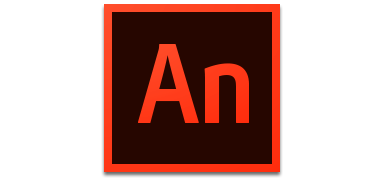
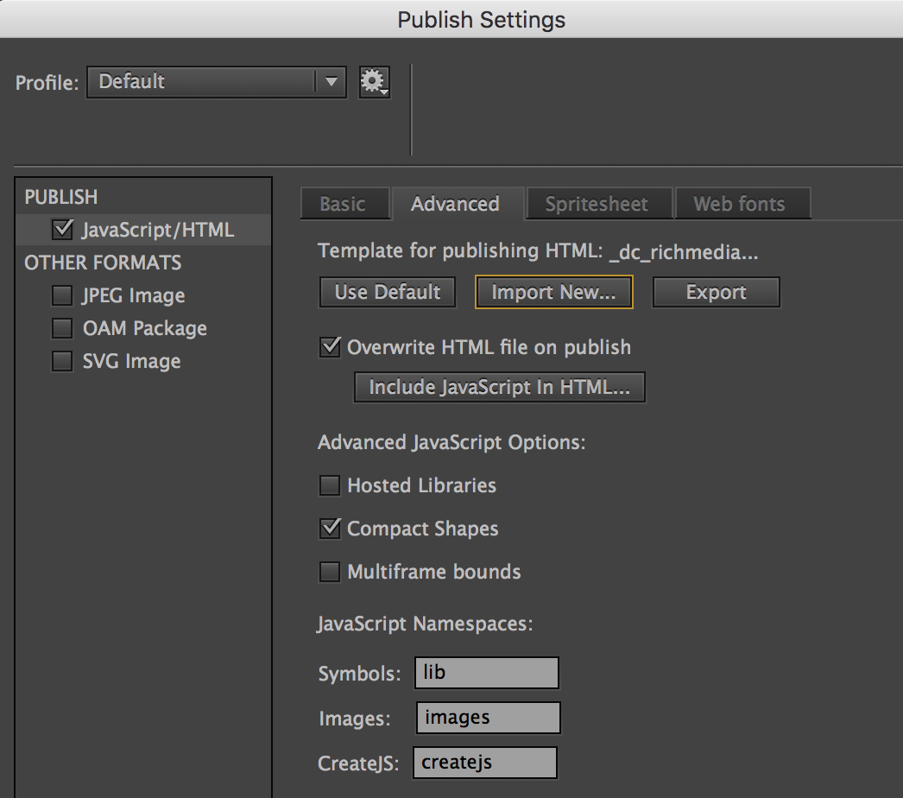

Fast Banner Template for Animate CC 2017
=======================


* This is a banner template with Animate CC in fast production envirenment.
* Build HTML5 banners with old school Flash features - timeline animation, blending, filter, vector masking and shape tween.

#### Features

* [DoubleClick Richmedia(Studio)](https://support.google.com/richmedia/answer/2672545), [DCM Standard(with ClickTag)](https://support.google.com/richmedia/answer/6279525?hl=en), [AdSense/Adwords/GDN Image ads](https://support.google.com/adwordspolicy/answer/176108?hl=en-AU) and [Sizmek(MediaMind)](https://www.sizmek.com/html5-guides/).
* support for DC expanding/pushdown and interstitial richmedia
* Never worry about DC's QA rejection again!
* Uses Google/Sizmek hosted [CreateJS](http://www.createjs.com/). This doesn't count towards filesize.
* Polite loading with preloader
* Supports version 2017(latest).


#### Requirements

[](http://www.adobe.com/au/products/animate.html)


Start building banners
---------------------------------------
1. Duplicate `_build/JOB0000_template_300x250` folder and rename it with your jobNumber_concept_pixelDimension. (For Expanding richmedia, use `_build/JOB0000_expand_1000x50to500`.)

2. Open the .fla file.
3. Update the stage width and height from Properties window.
4. Go to Publish Settings. On 'Advanced' tab, click 'Import New' button.
⋅⋅⋅ Pick the correct template from `_export_template/v2017`.



* `_dc_richmedia_v2017.html` - DoubleClick Studio Richmedia
* `_dc_richmedia_expanding_v2017.html` - DoubleClick Studio Expanding Richmedia
* `_dc_richmedia_interstitial_v2017.html` - DoubleClick Studio Interstitial Richmedia
* `_dc_richmedia_v2017.html` - DoubleClick Studio Richmedia
* `_dcm_std_v2017.html` - DoubleClick Standard banner for DCM
* `_gdn_adsense_adwords_v2017.html` - GDN and AdSense banner
* `_sizmek_std_v2017.html` - Sizmek Standard banner

5. Animate and publish to HTML.
6. For Expanding richmedia, set the collapsed dimension from html file after the banner is published. 

```javascript
var collapsed = {width:'1000px', height:'50px'};
```

#### `/psd` folder
This folder contains back-up static image template in PSD. 
On e uploaded to DoubleClick, a GIF/JPG/PNG file including 'backup' in filename will automatically be assigned as a back-up image.


License
---------------------------------------

The code is available under the [MIT license](LICENSE.md).
